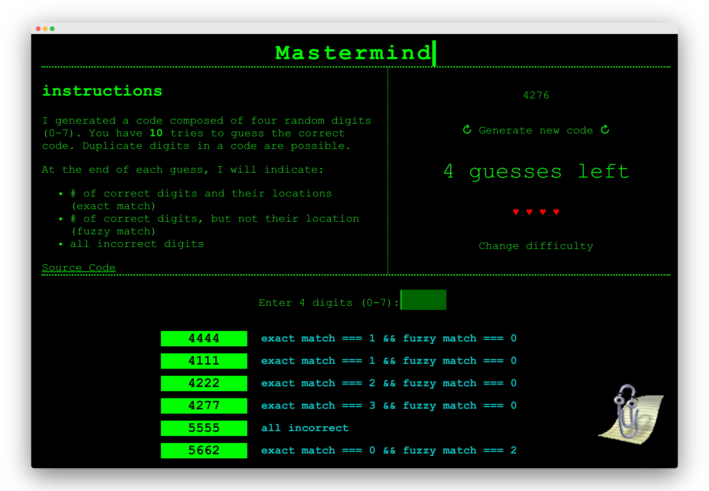
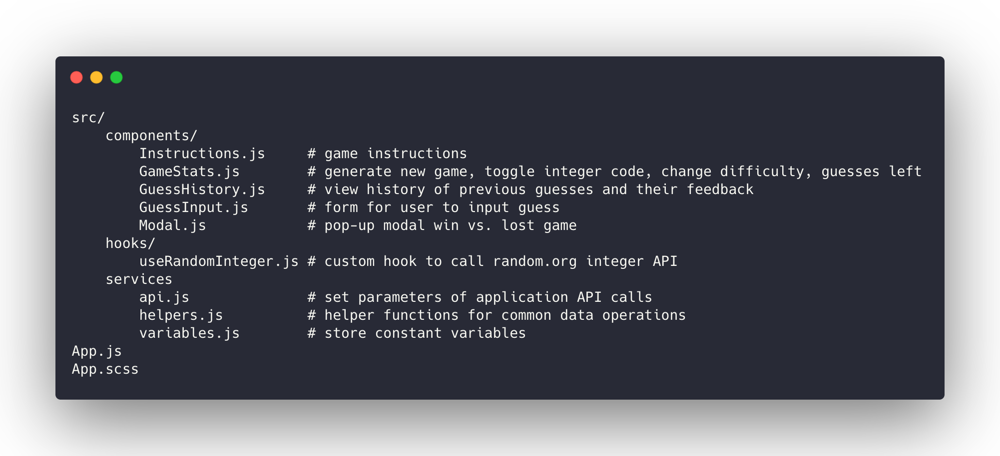

# Mastermind Game

[](https://app.netlify.com/sites/mastermind-lily/deploys)

The game is [deployed](https://mastermind-lily.netlify.com/), but the user experience is better when run locally due to small issues with Netlify loading of animated images. You can also check out a running version on [CodeSandbox](https://codesandbox.io/s/github/lilyhoratio/mastermind)

## Table of Contents

- [Overview](#overview)
- [Steps to run locally](#steps-to-run-locally)
- [Features](#features)
- [Application Structure](#application-structure)
- [Code Refactoring Highlights](#Code-refactoring-highlights)
- [Future Improvements](#future-improvements)
- [Tech stack](#tech-stack)

## Overview

Mastermind is a code-breaking game where the user attempts to guess the digits of a secret PIN. It is a take on the [Mastermind board game](<https://en.wikipedia.org/wiki/Mastermind_(board_game)>).

The player must guess a 4 digit code that has been randomly generated by the computer. At the end of each try, the computer provides feedback on whether the player guessed a number correctly and/or a number and its location correctly. The computer's feedback does not reveal which number the player guessed correctly.

To win, the player must guess the right combinations within 10 attempts.



## Steps to run locally

1. `git clone https://github.com/lilyhoratio/mastermind.git`
2. `cd mastermind-lily`
3. `yarn` to install dependencies
4. `yarn start` to launch React app
5. `yarn test` to run tests

## Features

MVP:

- [x] Ability to guess the combinations of 4 numbers
- [x] Ability to view the history of guesses and their feedback
- [x] The number of guesses remaining is displayed

Extra features:

- [x] Ability to toggle viewing the code combination for easier user testing
- [x] Conditional rendering of won game vs. lost game pop-ups
- [x] Ability to restart game by generating a new code combination - in pop-up when user wins or loses game, and the "Generate new code" component
- [x] Computer gives feedback after each guess with the count of exact (correct digit/location) vs. fuzzy matches (correct digit, not location)
- [x] User is prevented from accessing the input form after guessing the correct combination or when they reach 10 tries (form disappears)


- [x] Pacman ghost animation alert with conditional text for invalid inputs when the user:

  - types in non-integers
  - types an invalid digit (not between 0-7)
  - enters nothing
  - enters guess with more than 4 digits


- [x] Clippy (📎) animation when user wants to change difficulty, which prompts the user to change the number of max tries allowed. Changing the max tries resets state for number of guesses remaining.


## Application Structure



## Code Refactoring Highlights

I originally coded a simpler form of this as a CLI game using Node.js. After I got the basic game working, I decided to make it into a web app using React. Managing the state among different components proved to be more challenging than I expected, especially as I added more interactivity and detail to the computer feedback, while also breaking the game into smaller components and adding helper functions for DRY code. Here are some highlights of my thought process!

### Bug fix in algorithm to count exact vs. fuzzy matches

My first implementation had a bug in counting the exact match vs. fuzzy match of digits in the guess. Because the user could enter a code with duplicate digits, the count of fuzzy matches was sometimes inflated. For example, if the number was 5124, and the user guessed, 5555, the computer incorrected indicated 1 exact match and 3 fuzzy matches (should have been 0 fuzzy matches).

```javascript
const getComputerFeedback = guess => {
  let guessAndFeedback = { guess: guess };
  let fuzzyMatch = 0;
  let exactMatch = 0;

  for (let i = 0; i < guess.length; i++) {
    if (guess[i] === integerCombo[i]) {
      exactMatch++;
    }
    if (integerComboCopyArr.includes(guess[i])) {
      fuzzyMatch++;
    }
  }

  fuzzyMatch = fuzzyMatch - exactMatch;

  if (exactMatch === 4) {
    guessAndFeedback["feedback"] = "you win";
    setIsGameOver(true);
    setIsGameWon(true);
  } else if (fuzzyMatch === 0 && exactMatch === 0) {
    guessAndFeedback["feedback"] = "all incorrect";
  } else {
    guessAndFeedback[
      "feedback"
    ] = `correct location: ${exactMatch}, correct digit: ${fuzzyMatch}`;
  }

  return guessAndFeedback;
};
```

This is my fix for calculating the correct counts of exact vs. fuzzy matches to account for duplicate digits:

```javascript
const getComputerFeedback = guess => {
  let guessAndFeedback = { guess: guess };
  let fuzzyMatch = 0;
  let exactMatch = 0;

  let guessCopy = convertStringToIntArray(guess);
  let codeCopy = [...code];

  // Get the count of exact matches. Remove any matching elements from both the codeCopy & guess
  for (let i = 0; i < guess.length; i++) {
    if (guessCopy[i] === codeCopy[i]) {
      exactMatch++;
      guessCopy[i] = null;
      codeCopy[i] = null;
    }
  }

  for (let i = 0; i < guessCopy.length; i++) {
    if (codeCopy.includes(guessCopy[i]) && guessCopy[i] !== codeCopy[i]) {
      fuzzyMatch++;
      codeCopy[codeCopy.indexOf(guessCopy[i])] = null;
    }
  }

  if (exactMatch === 4) {
    guessAndFeedback["feedback"] = "you win";
    setIsGameOver(true);
    setIsGameWon(true);
  } else if (fuzzyMatch === 0 && exactMatch === 0) {
    guessAndFeedback["feedback"] = "all incorrect";
  } else {
    guessAndFeedback[
      "feedback"
    ] = `exact match: ${exactMatch}, fuzzy match: ${fuzzyMatch}`;
  }

  return guessAndFeedback;
};
```

Setting a key and value for each if statement seemed repetitive, so I further refactored the function into the following:

```js
const getComputerFeedback = guess => {
  let feedback = "";

  // ===== hidden ===== //

  if (exactMatch === 4) {
    feedback = "you win";
    setIsGameOver(true);
    setIsGameWon(true);
  } else if (fuzzyMatch === 0 && exactMatch === 0) {
    feedback = "all incorrect";
  } else {
    feedback = `exact match === ${exactMatch} && fuzzy match === ${fuzzyMatch}`;
  }

  return { guess, feedback };
};
```

### API call - refactoring into a custom hook

Originally, in App.js, this was my API call:

```js
const [code, setCode] = useState([]);

useEffect(() => {
  api
    .getRandomIntegers()
    .then(res => {
      let rawIntegers = res.data;
      let cleanedIntegers = convertStringToIntArray(rawIntegers, "\n");
      cleanedIntegers.pop(); // remove last element due to extra \n separator
      setCode(cleanedIntegers);
    })
    .catch(err => console.log(err));
}, []);
```

Because I wanted the ability to reset the random integer in other components based on user interactions in other components, I ended up abstracting away the logic of the API call through a custom hook. Thanks to these two articles for guides on how to do so: https://blog.siliconjungles.io/how-to-use-react-hooks-to-abstract-api-calls & https://blog.bitsrc.io/simple-code-reuse-with-react-hooks-432f390696bf.

```js
// In hooks.js

export function useRandomInteger(method) {
  const [data, setData] = useState(null);
  const [isLoading, setIsLoading] = useState(false);
  const [error, setError] = useState(null);

  const changeData = () => {
    api
      .getRandomIntegers()
      .then(res => {
        let rawIntegers = res.data;
        // let cleanedIntegers = convertStringToIntArray(rawIntegers, "\n");
        let cleanedIntegers = rawIntegers.split("\n").map(int => parseInt(int));
        cleanedIntegers.pop(); // remove last element due to extra \n separator
        setIsLoading(true);
        setData(cleanedIntegers);
      })
      .catch(err => {
        console.log(err);
        setError(err);
      });
  };

  return [data, changeData, isLoading, error];
}
```

App.js could now be simplified to the following:

```js
const [code, changeCode, isLoading, error] = useRandomInteger();

useEffect(() => {
  changeCode();
}, []);
```

And the `changeCode` function passed down to <GameStats /> component and used in an onClick method:

```js
// In <GameStats /> component:

<div className="button new-game-button" onClick={changeCode}>
  ↻ Generate new code ↻
</div>
```

I also noticed the logic to clean the user input was similar to the logic to clean the API response, so created a helper function called
`convertStringToIntArray` to convert both the Random Integer API response and user input from raw strings into an array of integers.

```js
// In src/services/helpers.js
const convertStringToIntArray = (stringInt, separator = "") => {
  return stringInt.split(separator).map(stringInt => parseInt(stringInt, 10));
};

// Above function is used in hooks/useAPI.js:
api.getRandomIntegers().then(res => {
  let rawIntegers = res.data;
  let cleanedIntegers = convertStringToIntArray(rawIntegers, "\n");
  // etc
});

// Also used in App.js to convert the user's form input:
guess = convertStringToIntArray(guess);
```

### Pacman Ghost animation based on invalid user inputs

The nostalgia of my terminal theme game made me think of Pacman. In order to animate my Pacman ghost, I set `appear` as a boolean state which defaulted to `false`. This variable would be set to `true` if the user input went into several conditionals, which are reflected in the `handleChange` and `handleSubmit` functions.

Making the ghost animate was trickier than I expected, and I learned about the React synthetic event called onAnimationEnd. In order to reset `appear` back to `false` using the `setAppear` hook, I invoked the `setAppear` hook onAnimationEnd of the CSS animation. This allowed me to conditionally render a className `ghost-container` vs. `ghost-container-hidden` based on the `appear` state.

```js
// <GuessInput /> component

import React, { useState } from "react";
import Ghost from "../images/ghost.png";

function PlayerGuessInput({ addGuess, isGameOver }) {
  const [guess, setGuess] = useState("");
  const [appear, setAppear] = useState(false);
  const [ghostText, setGhostText] = useState("");

  const handleChange = e => {
    if (e.target.value.match(/\D/)) {
      setGhostText("only numbers allowed!!!");
      setAppear(true);
    } else if (e.target.value.match(/[8-9]/)) {
      setGhostText(`${e.target.value} is not between 0-7!!!`);
      setAppear(true);
    } else {
      setGuess(e.target.value);
    }
  };

  const handleSubmit = e => {
    e.preventDefault();

    if (guess.length > 4) {
      setGhostText("too many digits!!!");
      setAppear(true);
    } else if (guess.length === 0) {
      setGhostText("enter something!!!");
      setAppear(true);
    } else {
      addGuess(guess);
      setGuess("");
    }
  };

  return (
    !isGameOver && (
      <>
        <form onSubmit={handleSubmit}>
          <label>
            Enter 4 digits (0-7):
            <input
              type="text"
              name="guess"
              placeholder=""
              value={guess}
              onChange={handleChange}
              className="guess-input"
            />
          </label>
        </form>
        <div
          className={`ghost-container${appear ? "" : "-hidden"}`}
          onAnimationEnd={() => setAppear(false)}
        >
          
          <span id="ghost-rawr">{ghostText}</span>
        </div>
      </>
    )
  );
}

export default PlayerGuessInput;
```

The SASS for the animation-related classes was as follows:

```scss
.ghost-container {
  position: fixed;
  bottom: 10px;
  left: 10px;
  display: flex;
  flex-direction: row;
  animation: ghostappears 4s ease;

  #ghost {
    width: 100px;
    height: auto;
  }

  #ghost-rawr {
    color: red;
    font-weight: bold;
    z-index: 999;
  }
}

.ghost-container-hidden {
  opacity: 0%;
}

@keyframes ghostappears {
  0% {
    opacity: 10%;
    transform: translateY(100px);
  }
  20% {
    opacity: 100%;
    transform: translateY(0px);
  }
  50% {
    opacity: 100%;
    transform: translateY(20px);
  }
  100% {
    opacity: 10%;
    transform: translateY(100px);
  }
}
```

## Future Improvements

With more time, I would love to add the following:

- Unit tests
- Make the getRandomInteger function reusable with ability to pass in parameters for min digit, max digit, and number of digits.
- Create pop-up that displays the `error` if API is down.
- Break out the SASS files into different components, rather than have them all in App.scss
- Mobile-responsive

## Tech Stack

- React
- SASS
- Axios
- Random.org API for random numbers
- [Clippy.js](https://github.com/SaraVieira/useClippy)
